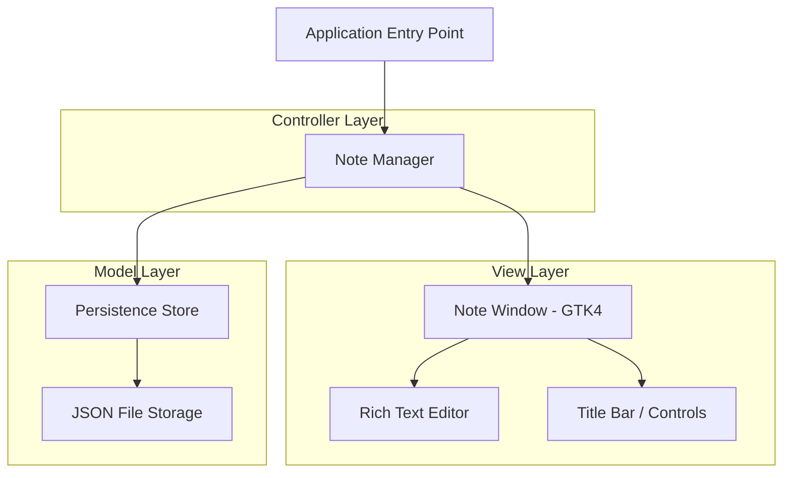

# Design Document: Sticky Notes App

## Overview

This document describes the technical design for a Linux desktop sticky notes application. The application provides persistent, resizable, rich-text notes that stick to the desktop. It is built using Python with GTK4 for the UI framework and GtkSourceView for rich text editing. Notes are stored as JSON files in the user's XDG data directory, ensuring persistence across restarts and reboots.

## Architecture

The application follows a Model-View-Controller (MVC) architecture:



**Key Architectural Decisions:**

1. **GTK4** - Native Linux toolkit with excellent Wayland and X11 support, compositor integration for desktop widget behavior, and rich widget library.
2. **Python** - Rapid development, strong GTK bindings via PyGObject, accessible for community contributions.
3. **JSON file storage** - Simple, human-readable, one file per note for atomic operations and corruption isolation.
4. **XDG Base Directory** - Notes stored in `~/.local/share/sticky-notes-app/notes/` following Linux conventions.

## Components and Interfaces

### 1. Application Entry Point (`main.py`)

Initializes GTK4 application, loads notes, sets up system tray indicator, and configures autostart.

```python
class StickyNotesApp(Gtk.Application):
    def do_activate(self):
        """Load all notes and display them on desktop."""
        pass
    
    def create_note(self) -> Note:
        """Create a new note with default settings."""
        pass
    
    def delete_note(self, note_id: str) -> None:
        """Delete a note by ID from manager and persistence."""
        pass
```

### 2. Note Manager (`note_manager.py`)

Central controller managing note lifecycle, ID generation, and coordination between views and persistence.

```python
class NoteManager:
    def create_note(self) -> Note:
        """Create note with unique ID, default dimensions, default color."""
        pass
    
    def delete_note(self, note_id: str) -> None:
        """Remove note from active notes and delete persisted data."""
        pass
    
    def get_all_notes(self) -> List[Note]:
        """Return all active notes."""
        pass
    
    def restore_notes(self) -> None:
        """Load and display all persisted notes."""
        pass
    
    def reposition_offscreen_note(self, note: Note, screen_width: int, screen_height: int) -> None:
        """Move off-screen notes to nearest visible edge."""
        pass
```

### 3. Note Window (`note_window.py`)

GTK4 window representing a single sticky note with title bar, editor, and resize handles.

```python
class NoteWindow(Gtk.Window):
    def __init__(self, note: Note):
        """Create window with desktop widget hints, resize handles, title bar."""
        pass
    
    def set_sticky_mode(self, always_on_top: bool) -> None:
        """Toggle between desktop-level and always-on-top."""
        pass
    
    def set_background_color(self, color: str) -> None:
        """Update note background color."""
        pass
    
    def apply_resize_constraints(self, width: int, height: int) -> Tuple[int, int]:
        """Clamp dimensions to min/max bounds."""
        pass
```

### 4. Rich Text Editor (`editor.py`)

GtkSourceView-based editor supporting bold, italic, underline, lists, and font sizes.

```python
class RichTextEditor(Gtk.TextView):
    def apply_format(self, format_type: FormatType, selection: Optional[TextRange]) -> None:
        """Apply formatting to selection or cursor position."""
        pass
    
    def get_content_as_html(self) -> str:
        """Export editor content as HTML string for persistence."""
        pass
    
    def load_content_from_html(self, html: str) -> None:
        """Load HTML content into editor."""
        pass
```

### 5. Persistence Store (`persistence.py`)

Handles JSON serialization/deserialization of notes to disk with debounced autosave.

```python
class PersistenceStore:
    def save_note(self, note: Note) -> None:
        """Serialize and write note to JSON file."""
        pass
    
    def load_note(self, file_path: str) -> Optional[Note]:
        """Deserialize note from JSON file, returns None on corruption."""
        pass
    
    def load_all_notes(self) -> List[Note]:
        """Load all notes from storage directory."""
        pass
    
    def delete_note_file(self, note_id: str) -> None:
        """Remove note's JSON file from disk."""
        pass
    
    def serialize(self, note: Note) -> str:
        """Convert Note to pretty-printed JSON string."""
        pass
    
    def deserialize(self, json_str: str) -> Note:
        """Parse JSON string into Note object."""
        pass
```

### 6. Color Palette (`colors.py`)

Predefined color palette and color management.

```python
COLOR_PALETTE = {
    "yellow": "#FFEB3B",
    "green": "#C8E6C9",
    "blue": "#BBDEFB",
    "pink": "#F8BBD0",
    "purple": "#E1BEE7",
    "orange": "#FFE0B2",
    "white": "#FFFFFF",
    "gray": "#E0E0E0",
}

DEFAULT_COLOR = "yellow"
```

## Data Models

### Note Model

```python
@dataclass
class Note:
    id: str                  # UUID string
    content: str             # HTML-formatted rich text content
    position_x: int          # X coordinate on screen
    position_y: int          # Y coordinate on screen
    width: int               # Note width in pixels
    height: int              # Note height in pixels
    color: str               # Color key from palette
    always_on_top: bool      # Whether note is above all windows
    created_at: str          # ISO 8601 timestamp
    modified_at: str         # ISO 8601 timestamp
```

### JSON Schema

```json
{
  "id": "uuid-string",
  "content": "<html content>",
  "position_x": 100,
  "position_y": 200,
  "width": 300,
  "height": 300,
  "color": "yellow",
  "always_on_top": false,
  "created_at": "2024-01-01T00:00:00Z",
  "modified_at": "2024-01-01T00:00:00Z"
}
```

### Constants

```python
MIN_WIDTH = 200
MIN_HEIGHT = 150
DEFAULT_WIDTH = 300
DEFAULT_HEIGHT = 300
AUTOSAVE_DELAY_MS = 2000
STORAGE_DIR = "~/.local/share/sticky-notes-app/notes/"
```

## Correctness Properties

*A property is a characteristic or behavior that should hold true across all valid executions of a system—essentially, a formal statement about what the system should do. Properties serve as the bridge between human-readable specifications and machine-verifiable correctness guarantees.*

### Property 1: Serialization Round-Trip

*For any* valid Note object, serializing it to JSON and then deserializing the JSON back into a Note object SHALL produce an object equivalent to the original. Furthermore, serializing the result a second time SHALL produce output identical to the first serialization.

**Validates: Requirements 4.5, 8.1, 8.2, 8.3, 8.4**

### Property 2: Unique ID Generation

*For any* number of notes created by the Note_Manager, all assigned note IDs SHALL be distinct from one another.

**Validates: Requirements 1.3**

### Property 3: Note Deletion Removes from Manager and Store

*For any* set of notes managed by the Note_Manager, deleting a note by its ID SHALL result in that note being absent from both the active notes list and the persistence store.

**Validates: Requirements 1.2**

### Property 4: Resize Dimension Clamping

*For any* resize operation with arbitrary target width and height values, the resulting note dimensions SHALL be clamped such that width is between 200 and screen_width (inclusive) and height is between 150 and screen_height (inclusive).

**Validates: Requirements 3.2, 3.3**

### Property 5: Off-Screen Position Correction

*For any* note with a saved position that falls outside the current screen bounds, restoring that note SHALL place it at coordinates within the visible screen area, at the nearest edge to its original position.

**Validates: Requirements 7.2**

### Property 6: Corrupted Data Graceful Handling

*For any* string of invalid or corrupted JSON data, attempting to deserialize it into a Note SHALL not crash the application, SHALL return an error indication, and SHALL log the corruption.

**Validates: Requirements 8.5**

### Property 7: Formatting Preserves Unselected Content

*For any* text content and any selection range within that content, applying a formatting operation SHALL modify only the selected range while leaving all content outside the selection unchanged.

**Validates: Requirements 2.4**

## Error Handling

| Error Condition | Handling Strategy |
|---|---|
| Disk write failure during save | Display GTK notification to user, retry on next change, log error |
| Corrupted JSON file on load | Log error with filename, skip note, continue loading others |
| Invalid note ID on delete | Log warning, no-op |
| Off-screen position on restore | Reposition to nearest visible screen edge |
| Missing storage directory | Create directory structure on first run |
| GTK initialization failure | Print error to stderr, exit with non-zero code |

## Testing Strategy

### Property-Based Tests (Hypothesis)

The project uses **Hypothesis** (Python PBT library) for property-based testing:

- Minimum 100 iterations per property test
- Each test tagged with: **Feature: sticky-notes-app, Property {N}: {title}**
- Generators produce random Note objects with valid field ranges
- Focus on pure functions: serialization, dimension clamping, position correction

### Unit Tests (pytest)

- Example-based tests for UI behavior (note creation defaults, color palette)
- Edge case tests for boundary conditions
- Mock-based tests for GTK window interactions

### Integration Tests

- Desktop stickiness behavior with window manager
- Autosave timing verification
- Autostart configuration validation

### Test Organization

```
tests/
├── test_persistence.py      # Property tests for serialization round-trip
├── test_note_manager.py     # Property tests for ID uniqueness, deletion
├── test_resize.py           # Property tests for dimension clamping
├── test_positioning.py      # Property tests for off-screen correction
├── test_editor.py           # Property tests for formatting
├── test_colors.py           # Unit tests for color palette
└── test_integration.py      # Integration tests for desktop behavior
```
